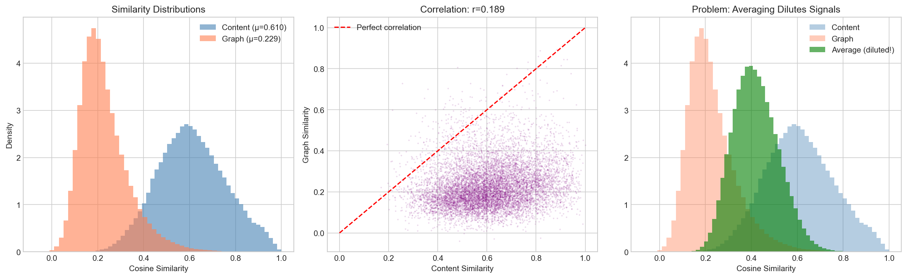
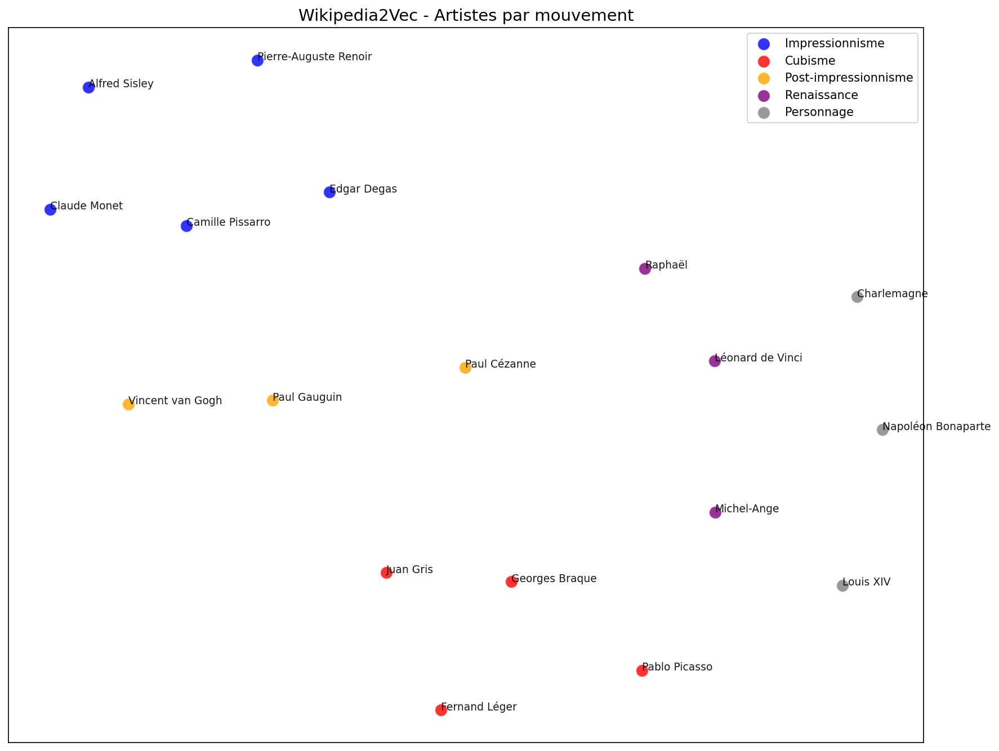
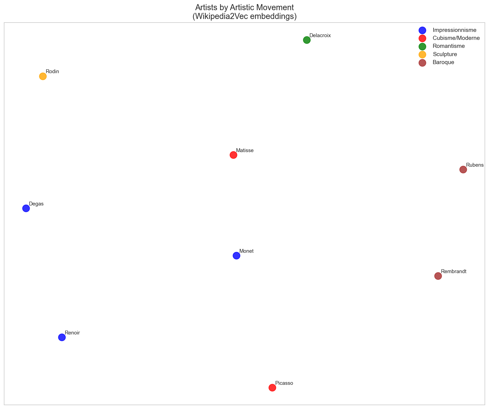
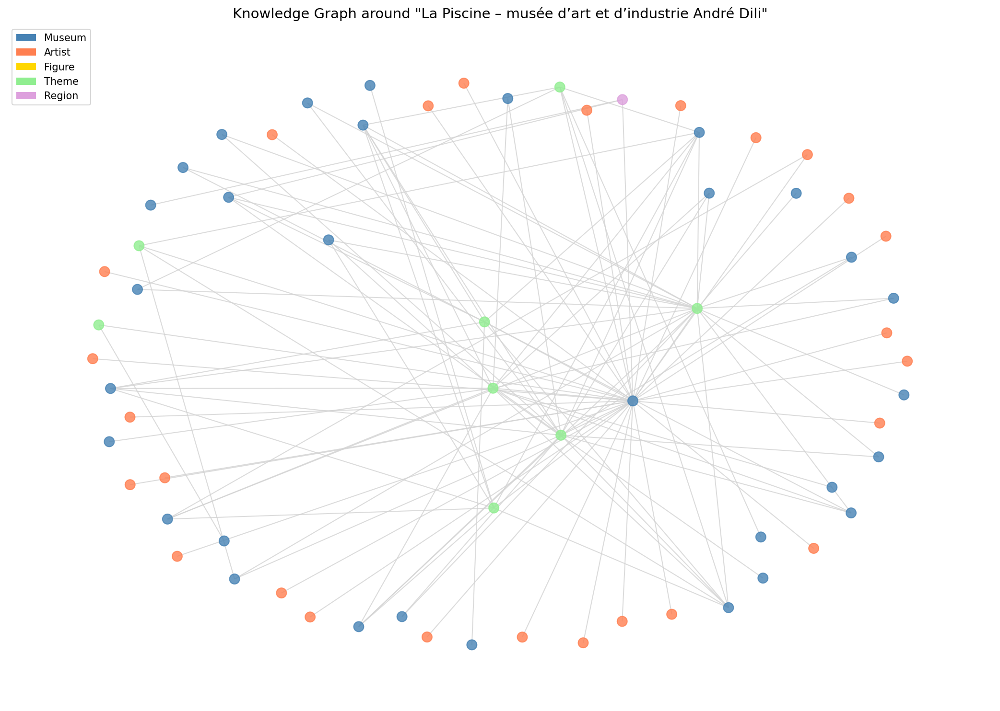
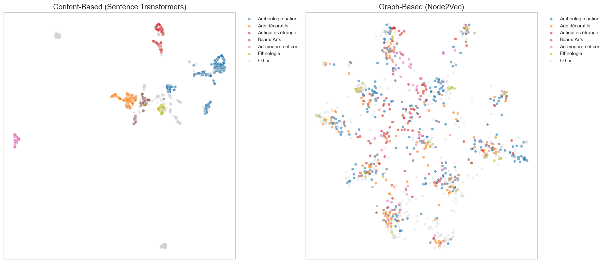
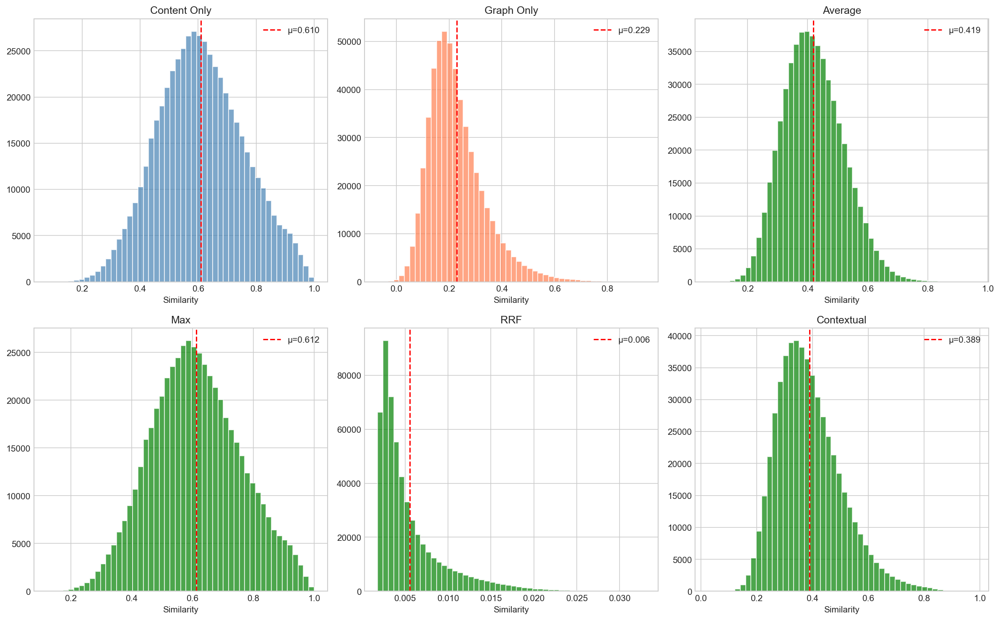

# French Museum Recommendation Engine

A multi-approach recommendation system for French museums combining NLP, knowledge graphs, and hybrid fusion strategies.

## Overview

This project explores **three complementary approaches** to museum recommendations:

1. **Content-Based**: Sentence Transformers + Wikipedia2Vec for semantic understanding
2. **Graph-Based**: Knowledge graph + Node2Vec for structural relationships
3. **Hybrid**: Advanced fusion strategies (RRF, Max, Contextual) when distributions don't overlap

The system uses the official **Muséofile** dataset (~1,200 French museums) and demonstrates that different approaches capture different aspects of similarity.

### Key Insight: Why Hybrid?

Content and graph models capture **different similarity signals** with minimal overlap:



This motivates our use of **Reciprocal Rank Fusion** instead of simple averaging.

## Dataset

The project uses the **Muséofile** dataset, the official directory of French museums maintained by the French Ministry of Culture.

- **Source**: [Muséofile - Répertoire des musées de France](https://www.culture.gouv.fr/thematiques/musees/Les-musees-en-France/les-musees-de-france/museofile-le-repertoire-des-musees-de-france)
- **License**: Open Data (Licence Ouverte / Open License)
- **Records**: ~1,227 museums across France
- **Features**: 27 columns including location, themes, history, highlights, and more

### Key Fields Used

| Field | Description |
|-------|-------------|
| `Nom officiel` | Official museum name |
| `Histoire` | Historical background of the museum |
| `Atout` | Museum highlights and key attractions |
| `Thèmes` | Thematic categories (archaeology, fine arts, ethnology, etc.) |
| `Département` | French department (administrative region) |

## How It Works

### 1. Text Embedding Generation

Museum themes are weighted logarithmically (1st theme has most weight) and embedded using a multilingual sentence transformer:

```python
from sentence_transformers import SentenceTransformer
import numpy as np

model = SentenceTransformer('paraphrase-multilingual-mpnet-base-v2')

def create_weighted_theme_text(themes_str):
    """Weight = 1/log2(rank+1): theme 1 = 1.0, theme 2 = 0.63, etc."""
    themes = [t.strip() for t in themes_str.split(';')]
    weighted_parts = []
    for i, theme in enumerate(themes):
        weight = 1 / np.log2(i + 2)
        repeats = max(1, int(weight * 3))
        weighted_parts.extend([theme] * repeats)
    return '. '.join(weighted_parts)
```

### 2. Feature Engineering

The system combines multiple features:
- **Semantic embeddings**: From `Histoire` (history) and `Atout` (highlights)
- **Categorical features**: One-hot encoded `Thèmes` (themes)
- **Combined vector**: Average of embeddings + category vectors

### 3. Similarity Computation

Cosine similarity measures the angular distance between museum feature vectors:

```python
from sklearn.metrics.pairwise import cosine_similarity

similarity_matrix = cosine_similarity(feature_vectors)
```

### 4. Recommendation Generation

For any given museum, the system returns the top-N most similar museums based on their similarity scores.

## Installation

### Prerequisites

- Python 3.9+
- [uv](https://github.com/astral-sh/uv) (recommended) or pip

### Quick Setup with uv

```bash
# Clone the repository
git clone <repository-url>
cd museum-recommendation-engine

# Run the setup script (creates venv + installs dependencies + downloads model)
./setup.sh
```

### Manual Setup with uv

```bash
# Create virtual environment
uv venv

# Install dependencies
uv pip install -r pyproject.toml
```

### Alternative: Setup with pip

```bash
# Create virtual environment
python -m venv .venv
source .venv/bin/activate  # On Windows: .venv\Scripts\activate

# Install dependencies
pip install pandas numpy matplotlib seaborn scikit-learn sentence-transformers missingno jupyter
```

## Usage

### Running the Notebooks

```bash
# Activate environment
source .venv/bin/activate

# Run notebooks in order:
jupyter notebook notebooks/notebook.ipynb           # 1. Content-based
jupyter notebook notebooks/notebook_graph.ipynb     # 2. Graph-based
jupyter notebook notebooks/notebook_comparison.ipynb # 3. Comparison
jupyter notebook notebooks/notebook_hybrid.ipynb    # 4. Hybrid
```

### Quick Start

```python
import pandas as pd
import numpy as np
from sklearn.metrics.pairwise import cosine_similarity

# Load preprocessed data (after running notebooks)
df = pd.read_pickle('outputs/df.pkl')
X = np.stack(df['embedding_themes'].values)
similarity_matrix = cosine_similarity(X)

# Get recommendations for a specific museum
def get_recommendations(index, num_recommendations=5):
    sim_scores = list(enumerate(similarity_matrix[index]))
    sim_scores = sorted(sim_scores, key=lambda x: x[1], reverse=True)
    sim_scores = sim_scores[1:num_recommendations+1]
    return df.iloc[[i[0] for i in sim_scores]]

# Example: Get 5 similar museums to museum at index 673
recommendations = get_recommendations(673, 5)
print(recommendations[['Nom officiel', 'Département', 'Thèmes']])
```

## Project Structure

```
museum-recommendation-engine/
├── README.md                              # This file
├── CONTRIBUTING.md                        # Contribution guidelines
├── LICENSE                                # MIT License
├── pyproject.toml                         # Project dependencies
├── setup.sh                               # Setup script
├── musees-de-france-base-museofile.csv   # Dataset
│
├── notebooks/                             # Jupyter notebooks
│   ├── notebook.ipynb                     # Content-based approach
│   ├── notebook_graph.ipynb               # Graph-based approach
│   ├── notebook_comparison.ipynb          # Model comparison
│   └── notebook_hybrid.ipynb              # Hybrid fusion strategies
│
└── outputs/                               # Generated files
    ├── df.pkl                             # Content embeddings
    ├── df_graph.pkl                       # Graph embeddings
    ├── sim_graph.npy                      # Graph similarity matrix
    ├── sim_hybrid.npy                     # Hybrid similarity matrix
    ├── museum_mapping.pkl                 # ID mappings
    ├── hybrid_config.pkl                  # Hybrid model config
    └── *.png                              # Visualizations
```

## Notebooks

### 1. Content-Based Approach (`notebook.ipynb`)
Uses **Sentence Transformers** (paraphrase-multilingual-mpnet-base-v2) to create semantic embeddings from museum descriptions.

#### Wikipedia2Vec Entity Enrichment
Artists and historical figures are embedded using Wikipedia2Vec, capturing relationships that text embeddings miss:



Artists from the same movement cluster together:



Features:
- Log-weighted theme embeddings
- Wikipedia2Vec entity enrichment for artists/figures
- UMAP visualization
- Cosine similarity recommendations

### 2. Graph-Based Approach (`notebook_graph.ipynb`)
Builds a **knowledge graph** connecting museums, artists, figures, themes, and regions. Uses **Node2Vec** to learn graph embeddings.



Features:
- Heterogeneous knowledge graph construction
- Node2Vec random walk embeddings (128-dim)
- Link prediction for missing connections
- Community detection (Louvain algorithm)
- Centrality analysis

### 3. Model Comparison (`notebook_comparison.ipynb`)
Compares both approaches with metrics and visualizations:



- Similarity distribution analysis
- Recommendation overlap at different k values
- Case studies: agreement vs disagreement
- Regional performance analysis
- Side-by-side UMAP projections

### 4. Hybrid Approach (`notebook_hybrid.ipynb`)
Combines content-based and graph-based models using advanced fusion strategies. When similarity distributions don't overlap, simple averaging dilutes signals—so we use smarter methods:



| Strategy | Formula | Best For |
|----------|---------|----------|
| **Max** | `max(sim_c, sim_g)` | Maximize recall |
| **RRF** | Reciprocal Rank Fusion | Default choice (rank-based) |
| **Contextual** | Adapt weights by metadata | Variable data quality |
| **Intersection** | Recommend if both agree | High precision |

Features:
- Distribution analysis and problem visualization
- 4 fusion strategies with comparison
- `HybridRecommender` class with explainability
- Strategy evaluation metrics

## Technical Details

### Model: Multilingual MPNet

[paraphrase-multilingual-mpnet-base-v2](https://huggingface.co/sentence-transformers/paraphrase-multilingual-mpnet-base-v2) is a multilingual sentence embedding model supporting 50+ languages including French. It's trained on paraphrase data to produce embeddings where semantically similar texts have similar vector representations.

- **Architecture**: MPNet-base
- **Embedding dimension**: 768
- **Languages**: 50+ including French
- **Hugging Face**: `sentence-transformers/paraphrase-multilingual-mpnet-base-v2`

### Similarity Metrics

**Cosine Similarity** measures the cosine of the angle between two vectors:

$$\text{similarity}(A, B) = \frac{A \cdot B}{\|A\| \|B\|}$$

- Value range: [-1, 1]
- 1 = identical direction (maximum similarity)
- 0 = orthogonal (no similarity)
- -1 = opposite direction

## Generated Visualizations

All visualizations are stored in `outputs/`:

| Notebook | File | Description |
|----------|------|-------------|
| Content | `similarity_comparison.png` | Before/after Wikipedia2Vec |
| Content | `recommendation_overlap.png` | Recommendation stability |
| Content | `artist_cohesion.png` | Museums sharing artists |
| Content | `wiki2vec_*.png` | Wikipedia2Vec embeddings |
| Graph | `graph_sample.png` | Knowledge graph structure |
| Graph | `graph_embeddings_umap.png` | Node2Vec UMAP |
| Compare | `comparison_distributions.png` | Similarity distributions |
| Compare | `comparison_correlation.png` | Model correlation |
| Compare | `comparison_overlap.png` | Recommendation overlap |
| Compare | `comparison_by_region.png` | Regional analysis |
| Compare | `comparison_umap.png` | Side-by-side UMAP |
| Hybrid | `distribution_analysis.png` | Why averaging fails |
| Hybrid | `strategy_comparison.png` | Fusion strategies |
| Hybrid | `strategy_evaluation.png` | Strategy evaluation |

## Potential Improvements

- **Geographic filtering**: Recommend museums within a specific region or radius
- **User preferences**: Incorporate user ratings or visit history
- **Real-time API**: Deploy as a REST API service
- **Multi-language support**: Extend to museums in other countries
- **Evaluation**: Add ground-truth evaluation with user studies

## Dependencies

| Package | Version | Purpose |
|---------|---------|---------|
| pandas | ≥2.0.0 | Data manipulation |
| numpy | ≥1.24.0 | Numerical operations |
| scikit-learn | ≥1.3.0 | Similarity computation |
| sentence-transformers | ≥3.0.0 | Multilingual sentence embeddings |
| umap-learn | ≥0.5.0 | Dimensionality reduction |
| missingno | ≥0.5.0 | Missing data visualization |
| networkx | ≥3.0 | Knowledge graph construction |
| node2vec | ≥0.4.0 | Graph embeddings |
| wikipedia2vec | ≥1.0.0 | Entity embeddings from Wikipedia |

## References

- [Muséofile Dataset](https://www.culture.gouv.fr/thematiques/musees/Les-musees-en-France/les-musees-de-france/museofile-le-repertoire-des-musees-de-france)
- [Multilingual MPNet Model](https://huggingface.co/sentence-transformers/paraphrase-multilingual-mpnet-base-v2)
- [Sentence-Transformers Library](https://www.sbert.net/)
- [Wikipedia2Vec](https://wikipedia2vec.github.io/wikipedia2vec/)
- [Node2Vec: Scalable Feature Learning for Networks](https://arxiv.org/abs/1607.00653) (Grover & Leskovec, 2016)
- [Reciprocal Rank Fusion](https://plg.uwaterloo.ca/~gvcormac/cormacksigir09-rrf.pdf) (Cormack et al., 2009)

## License

This project is licensed under the MIT License - see the [LICENSE](LICENSE) file for details.

The Muséofile dataset is provided under the French Open License (Licence Ouverte / Open License v2.0).

## Author

Loïc Guillois

## Acknowledgments

- French Ministry of Culture for providing the Muséofile open dataset
- Hugging Face for Sentence Transformers
- Wikipedia2Vec team for entity embeddings
- Node2Vec authors (Grover & Leskovec, 2016)
